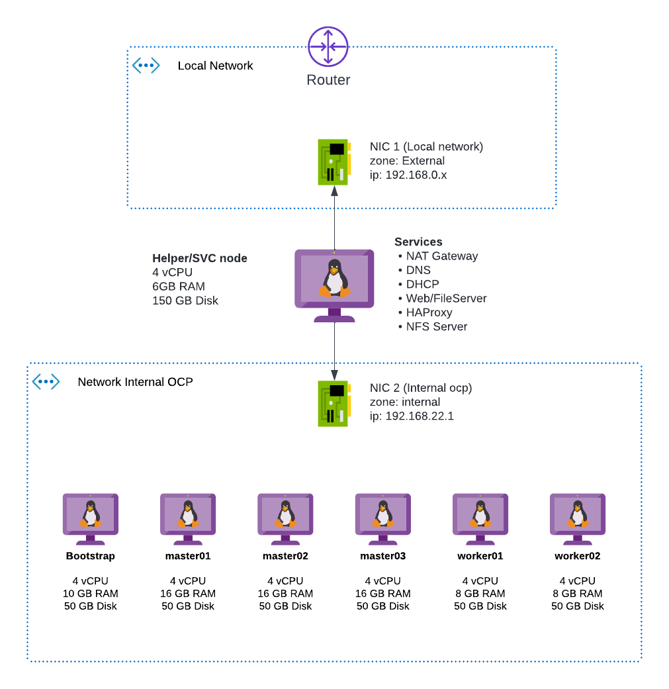

# OpenShift Installation on bare metal

This repo provides guide and template for network config to install OpenShift on bare metal.

Deployment this cluster requires 2 network one is use for internal ocp cluster and the other is used for external connection. both connection will be connected to Helper/SVC node. where it function 

prerequisites

    * OpenShift 4.x
    * RHCOS 8
    * NetworkManager
    * DNS Server
    * DHCP Server
    * HAProxy

## Step for isntallation

[SVC/Helper setups](docs/svc-setups.md)

[Host Installation files](docs/host-installation.md)

[Deploy Openshift](docs/deploy-openshift.md)